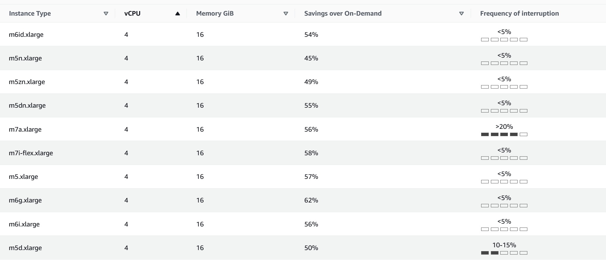
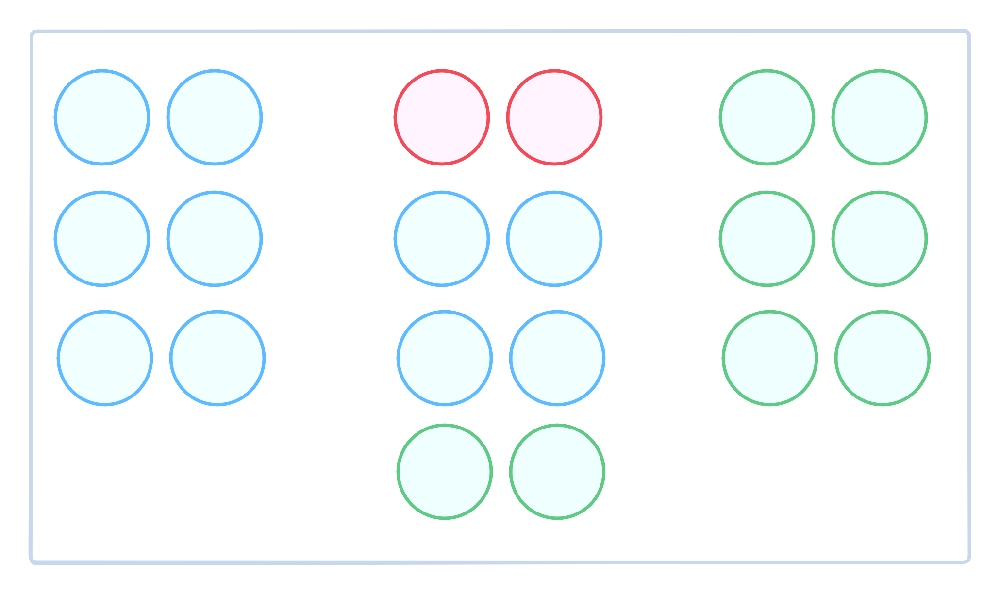

[](.coverbg)

# Auto Scaling Groups


The lesser-known goodies.

[](.agenda.powerlist)

### Agenda

* Building blocks
* Capacity management
* Lifecycle hooks
* Speeding up instance bootstrapping
* Refreshing instances

[](.coverbg)

## Building blocks


[]()

### What is a Launch Template?

It is a **versioned** resource describing the **desired state** of a fresh
instance. It is usually used in combination of one or
more Auto Scaling Groups.

```terraform
resource "aws_launch_template" "nginx" {
  name          = "nginx"
  image_id      = data.aws_ami.ubuntu_lts.id
  instance_type = "t3.small"
  block_device_mappings {
    ...
    ebs {
      volume_size = 8
    }
  }
  user_data = base64encode(<<EOF
  #!/bin/bash
  ...
  EOF
  )
}
```

[]()

### What is an Auto Scaling Group

It is a fleet of **self-healing servers** with a desired state. They
provide horizontal scalability for virtual machines and integrate
with services like **ELB**, **EventBridge** and **CloudWatch**.

```terraform
resource "aws_autoscaling_group" "nginx" {
  vpc_zone_identifier = data.aws_subnets.default.ids
 
  launch_template {
    id      = aws_launch_template.nginx.id
    version = "$Latest"
  }

  desired_capacity = 50
  max_size         = 500
  min_size         = 2
  ...
}
```

[](.coverbg)

## ASG capacity management


[]()

### Mixed fleets

It enhances the ability of the ASG of getting the required instances,
while providing greater spot resiliency. **AWS [recommends](https://docs.aws.amazon.com/autoscaling/ec2/userguide/mixed-instances-groups-set-up-overview.html#mixed-instances-group-instance-flexibility) 
using 10 instance types** as a best practice!

```terraform
resource "aws_autoscaling_group" "nginx" {
  ...
  mixed_instances_policy {
    launch_template {
      ...
      override {
        instance_type     = "t3.micro"
        weighted_capacity = "1"
      }
      override {
        instance_type     = "t3.small"
        weighted_capacity = "2"
      }
    }
  }
}
```

::: Notes

It is also possible to use attribute filters for selecting the
acceptable types, but it may be less specific than a explicit override:

```terraform
  ...
  mixed_instances_policy {
    ...
    launch_template {
      override {
        instance_requirements {
          memory_mib {
            min = 4000
          }

          vcpu_count {
            min = 2
          }
        }
      }
    }
  }
  ...
```

Also, it is important to know how the [termination policies](https://docs.aws.amazon.com/autoscaling/ec2/userguide/ec2-auto-scaling-termination-policies.html#default-termination-policy-mixed-instances-groups) concept
has been expanded to take into account mixed instance fleets.

:::

[](.picture)

### Freakonomics

As we are expanding our usage of different types of VMs, 
[Compute Savings Plans](https://aws.amazon.com/savingsplans/faq/) become
the best option for optimizing discounts.


::: Notes

[Icon created by BSD, flaticon](https://www.flaticon.es/iconos-gratis/administracion-del-dinero).
:::


[]()

### Mixed with spot

It is possible in the ASG to determine which percentage of the instances
should be created as spot and which one should be non-spot. This feature
provides an easy way to balance the risk of interruption in smaller fleets.

```terraform
resource "aws_autoscaling_group" "nginx" {
  ...
  mixed_instances_policy {
    instances_distribution {
      on_demand_allocation_strategy = "prioritized"  // or "lowest-price"
      on_demand_base_capacity       = 2
      on_demand_percentage_above_base_capacity = 25
      spot_allocation_strategy      = "price-capacity-optimized"
    }
    ...
  }
}
```

::: Notes

If you set mixed capacity in your ASG, your LT should
not specify any market option in your launch template.

*  `on_demand_allocation_strategy`: `prioritized`, `lowest-price`
*  `on_demand_base_capacity`: Minimum number of on-demand/reserved nodes.
*  `on_demand_percentage_above_base_capacity`: Once that minimum has been granted, percentage of on-demand for the rest of the total capacity.
*  `spot_allocation_strategy`: `lowest-price`  (minimizing cost), 
 `capacity-optimized` (focus on capacity),
 `capacity-optimized-prioritized` (pools with capacity, honoring instance priority), 
 `price-capacity-optimized` (recommended, pools with capacity choosing lowest price instance types).

This may be a good moment for counting instances:

```bash
aws ec2 describe-instances \
  --filter 'Name=tag:Name,Values=asgdemo' \
  --query 'Reservations[*].Instances[*].{Spot:InstanceLifecycle,Subnet:SubnetId,Type:InstanceType}' \
  --output text \
| cut -f1 \
| sort \
| uniq -c
```

:::

[]()

### Proactive capacity rebalancing

If enabled, the ASG will monitor the risk of spot instance interruption and
replace the affected machines *before* the event occurs.

It will not work if [scale-in protection](https://docs.aws.amazon.com/autoscaling/ec2/userguide/ec2-auto-scaling-instance-protection.html) is active.

```terraform
resource "aws_autoscaling_group" "nginx" {
  ...
  capacity_rebalance  = true
  ...
}
```

[](.picture)

### Spot advisor



[]()

### Kubernetes, you said?

Nodegroups can take advantage of spot instance allocation. In fact,
the ephemeral nature of Kubenetes workloads makes a strong case
for aggressive [spot usage](https://aws.amazon.com/blogs/compute/cost-optimization-and-resilience-eks-with-spot-instances/).

```yaml
kind: ClusterConfig
...
nodeGroups:
    - minSize: 0
      maxSize: 50
      desiredCapacity: 1
      instancesDistribution:
        instanceTypes: ["m5.xlarge", "m5n.xlarge", "m5d.xlarge"] 
        onDemandBaseCapacity: 0
        onDemandPercentageAboveBaseCapacity: 0
        spotAllocationStrategy: capacity-optimized
```

[]()

### LT License management

[License management](https://mng.workshop.aws/licensemanager.html) can
be integrated, automatically generating an audit of the actual usage of
the software and even limiting the creation of new instances.

```terraform
  ...
  license_specification {
    license_configuration_arn = "arn:aws:license-manager:eu-wes...lic-012def"
  }
  ...
```

::: Notes

This is a very important feature in such a dynamic environment. For example,
it can be managed for [optimizing Fortigate deployments](https://docs.fortinet.com/document/fortigate-public-cloud/7.4.0/aws-administration-guide/397979/deploying-auto-scaling-on-aws).

:::

[](.coverbg)

## Lifecycle hooks


[]()

### Types of hooks

ASGs may trigger actions before completing each stage on their instances
by putting a message in an **EventBridge** bus, a **SNS** topic or a **SQS** queue.

`autoscaling:EC2_INSTANCE_LAUNCHING` can be used for ensuring software
deployment before registering the new instance in a load balancer.

`autoscaling:EC2_INSTANCE_TERMINATING` is useful for cleaning up, log aggregation,
canceling an unexpected instance termination, etc.

[]()

### Hook example: configuration

```terraform
resource "aws_autoscaling_lifecycle_hook" "nginx" {
  name                   = "nginx_instance_launched"
  autoscaling_group_name = aws_autoscaling_group.nginx.name
  lifecycle_transition   = "autoscaling:EC2_INSTANCE_LAUNCHING"
  heartbeat_timeout      = 600
  default_result         = "CONTINUE"

  notification_metadata = jsonencode({
    my_action = "CONFIGURATION_COMPLETED"
  })

  notification_target_arn = "arn:aws:sqs:eu-west-1:444455556666:mysqs"
  role_arn                = "arn:aws:iam::123456789012:role/sqsaccess"
}
```

[]()

### Hook example: signaling completion

It is easy to signal the completion of a lifecycle event using the
SDK, but it is also possible to do it with the CLI (maybe **from
the user data** of the instance):

```bash
INSTANCE_ID=$(curl http://169.254.169.254/latest/meta-data/instance-id)

aws autoscaling complete-lifecycle-action \
  --lifecycle-hook-name nginx_instance_launched \
  --auto-scaling-group-name nginx \
  --lifecycle-action-result CONTINUE \
  --instance-id $INSTANCE_ID
```

[](.coverbg)

## Speeding up instance bootstrapping


[]()

### Slow boot factors

#### What impacts

* AMI size
* Software installation
* Extensive configuration IO operations

#### What you try

* Deactivating unnecessary services.
* Debloating the installation.
* Pre installing the updates.
* Adding the required software.
* Creating a custom AMI.

::: Notes

Creating a custom AMI is almost mandatory with Windows,
but boot EBS volume content is going to be streamed in
as-needed bases from S3, providing slow performance
even with if following best-practices.

:::

[](#windows,.coverbg)

### In one word: Windows!


::: Notes

To put it succinctly, **Windows AMIs are really big**, more than 8GB in size. And EBS volumes
restored from snapshots (including bootstrapping ones created from
AMIs) **have their content copied asynchronously**, unless using
the very limited [fast snapshot restoration option](https://docs.aws.amazon.com/ebs/latest/userguide/ebs-fast-snapshot-restore.html).
This will impact a lot in the amount of time required for
starting up Windows Server.

:::

[]()

### Warm pools

A warm pool is a group of pre-initialized (**stopped**, usually) EC2 instances 
aiding an Auto Scaling group to quickly scale out.

```terraform
resource "aws_autoscaling_group" "nginx" {
  ...
  warm_pool {
    pool_state                  = "Hibernated"
    min_size                    = 5
    max_group_prepared_capacity = 10
    instance_reuse_policy {
      reuse_on_scale_in = true
    }
  }
}
```

::: Notes

The ASG will keep between `min_size` and `max_group_prepared_capacity` warmed
instances. For example, with a `desired` of 2 and `min_size` of 4 the
ASG will create four instances and stop/hibernate two of them. By the way,
Windows hibernation is supported since 2019.

`pool_state` can be `stopped`, `running` or `hibernated` indicating the
desired state of the warmed instances.

`reuse_on_scale_in` should be `true` if instance are planned to be kept
in the warm pool after a scale-in event.

:::

[](.coverbg)

## Refreshing instances


[]()

### Maximum instance lifetime

For security reasons it is common to set a limit in the amount of time
an instance can be allowed to exist before being **replaced with a fresh one**.
The ASG will try to replace one instance at a time, with a pause between
each termination, but too short intervals may cause a more aggressive behavior.

```terraform
resource "aws_autoscaling_group" "nginx" {
  vpc_zone_identifier = data.aws_subnets.default.ids

  desired_capacity = 50

  max_instance_lifetime = 60*60*24*7
  ...
```

::: Notes

Yes, yes: this feature has been used to replace instances running
applications with **memory leaks** on regular intervals.

:::


[](.picture)

### How rolling upgrade works



::: Notes

A [rolling upgrade](https://docs.aws.amazon.com/whitepapers/latest/overview-deployment-options/rolling-deployments.html)
replaces the infrastructure that runs the original version of an application with fresh infrastructure
executing a newer version, usually proceeding in batches to allow the owners of the application to
check if everything is happening as expected.

:::

[]()

### Auto Scaling Group refreshing

ASG have incorporated a **rolling upgrade** feature called [Instance Refresh](https://docs.aws.amazon.com/autoscaling/ec2/userguide/asg-instance-refresh.html). It provides a well-designed UX through the **web console**,
including the definition of checkpoints. But it can also be configured and triggered using
**Terraform** and the [CLI](https://awscli.amazonaws.com/v2/documentation/api/latest/reference/autoscaling/start-instance-refresh.html).

```terraform
resource "aws_autoscaling_group" "nginx" {
  ...
  instance_refresh {
    strategy = "Rolling"
    preferences {
      checkpoint_percentages = [33, 66, 100]
      checkpoint_delay       = 60*10
      min_healthy_percentage = 75
      skip_matching          = true
    }
    triggers = ["launch_template"]
  }
}
```

[](#closing,.coverbg)

## Clap if you enjoyed it!


Javi Moreno

[linkedin.com/in/javier-more](https://www.linkedin.com/in/javier-more/)